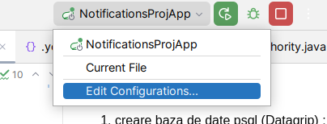
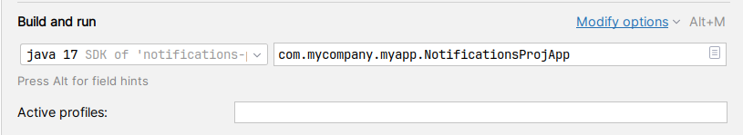
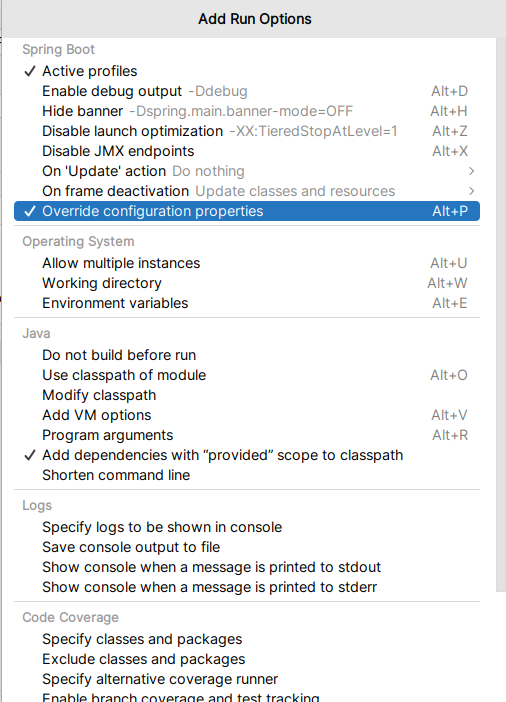

Cerințe preliminare:
- InteliiJ IDEA
- Java SDK 17 
- NodeJS
- psql 14

Instrucțiuni pentru pornirea proiectului :

1. Creare baza de date psql (Datagrip) : notificationsproj
2. In IntelliJ IDEA facem override la următoarele proprietăți (schimbăm password username cum e configurat local)

Click modify options :

Click

3. Pornim backendul
4. Deschidem terminalui și executăm urmatoarele comenzi:

- npm install
- npm start

In browser în loc de 9000 folosim portul 4200

Fișierul de log poate fi accesat: {user.home}/spring-boot-logger.log
Putem vizualiza documentația la API: http://localhost:4200/admin/docs
